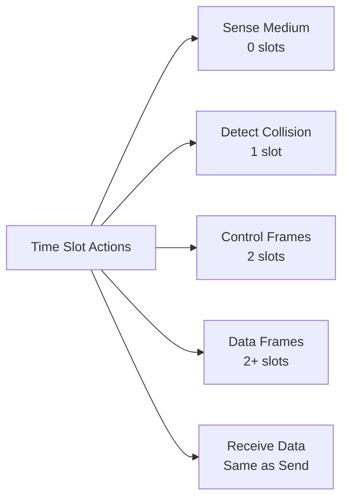
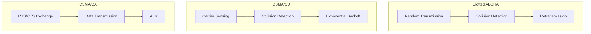
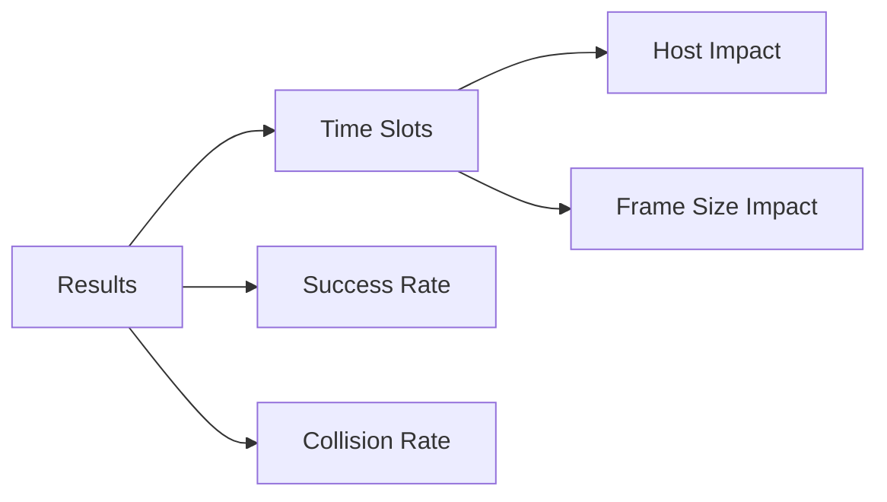
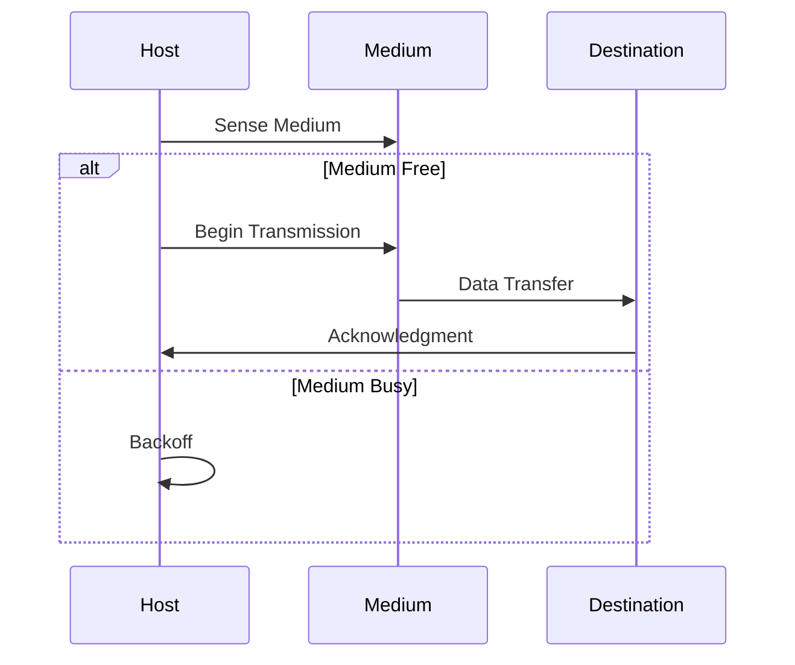

# Network Protocol Simulation Project
A Python implementation simulating and comparing three network protocols: Slotted ALOHA, CSMA/CD, and CSMA/CA.

## Overview
This project simulates the behavior of three different network protocols in a shared medium environment. It analyzes how each protocol performs under varying conditions like number of hosts and frame sizes.

## Protocol Implementations

### Time Slot Actions


### Protocol Characteristics


## Project Structure

```
project/
├── Network_Simulation_Base_Classes.py
├── Protocol_Implementations.py
└── Test_Protocols.py
```

## Key Components

- **BaseSimulator**: Core simulation logic and timing management
- **Node**: Represents network hosts with transmission capabilities
- **Medium**: Simulates the shared communication channel
- **Frame**: Represents data packets with configurable sizes

## Requirements

- Python 3.7+
- matplotlib
- random
- enum

## Installation

```bash
git clone https://github.com/yourusername/network-protocol-simulation.git
cd network-protocol-simulation
```

## Usage

Run the simulation:
```bash
python Test_Protocols.py
```

### Configuration Options
- Number of hosts: [5, 10, 15, 20, 25]
- Frame size ranges: [5,10], [10,15], [15,20], [20,25]
- Frames per host: Configurable (default: 5)

## Results

### Performance Metrics
1. Total Time Slots Used
2. Success Rate
3. Collision Rate
4. Impact of Host Count
5. Impact of Frame Size

### Sample Output


### Performance Analysis
- **Slotted ALOHA**: Linear increase with host count
- **CSMA/CD**: Stable performance across conditions
- **CSMA/CA**: Complex behavior pattern with RTS/CTS overhead

## Implementation Details

### Medium Access Control


### Protocol-Specific Features

#### Slotted ALOHA
- Probabilistic transmission
- Simple collision handling
- No carrier sensing

#### CSMA/CD
- Carrier sensing before transmission
- Collision detection during transmission
- Exponential backoff algorithm

#### CSMA/CA
- RTS/CTS mechanism
- ACK frames
- Virtual carrier sensing

## Performance Optimizations
- Early termination conditions
- Maximum slot limits
- Efficient collision handling
- Optimized frame counts

## Contributing
1. Fork the repository
2. Create a feature branch
3. Commit changes
4. Push to the branch
5. Create a Pull Request

## License
[MIT License](LICENSE)

## Acknowledgments
- Project requirements based on networking course assignment
- Protocol implementations follow standard IEEE 802.11 specifications

